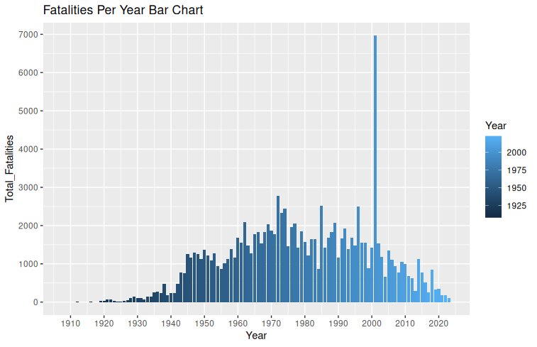
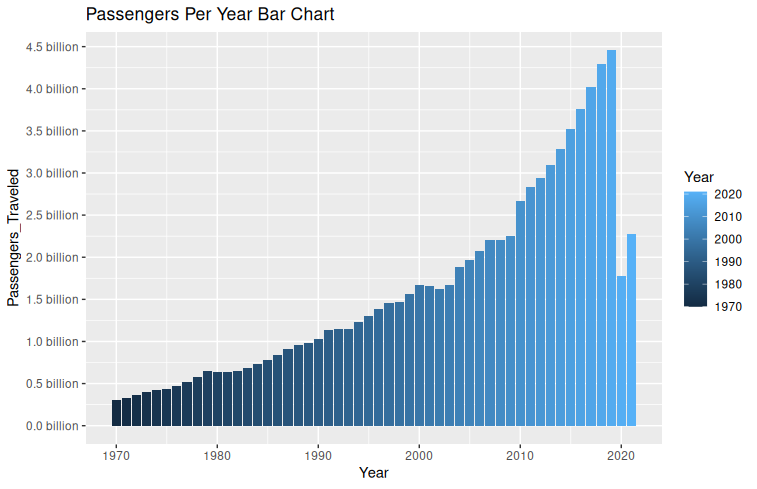
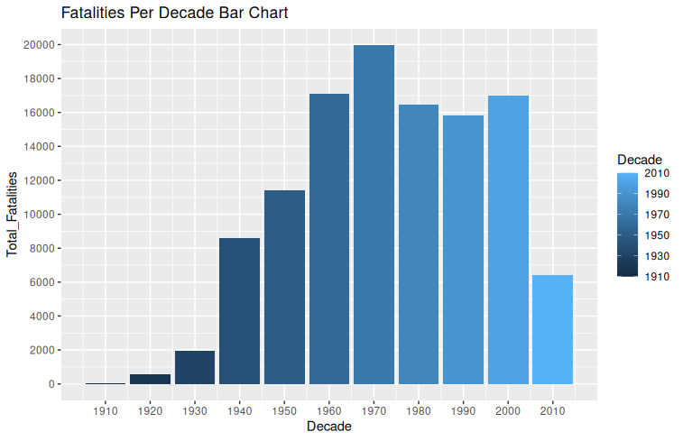
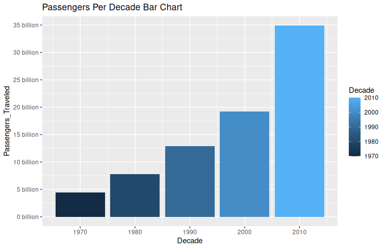
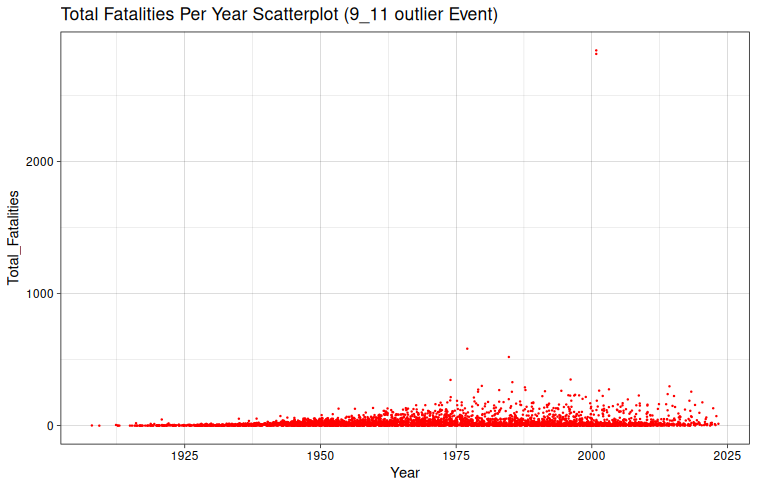
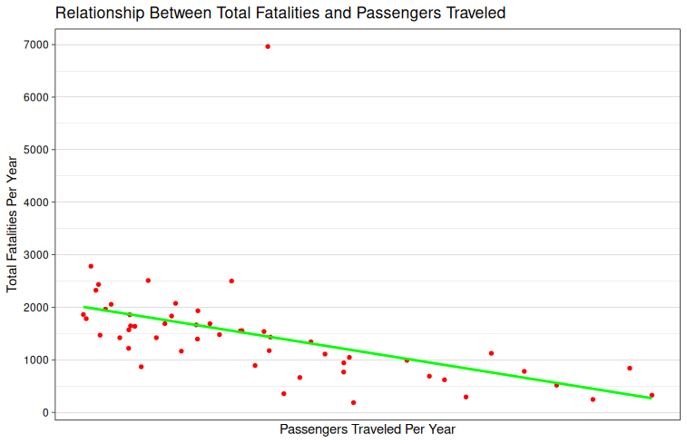

# Ανάλυση Αεροπορικών Ατυχημάτων και Δεδομένων Αερομεταφορών
###### Νίκος Παυλόπουλος |  Αποθετήριο GitHub : [https://github.com/nikospavlopoulos/plane\_crashes\_R](https://github.com/nikospavlopoulos/plane_crashes_R)

## 1\. Εισαγωγή
Τα αεροπορικά ταξίδια όχι μόνο έφεραν επανάσταση στον τρόπο με τον οποίο μετακινούμαστε παγκοσμίως, αλλά και άλλαξαν την κουλτούρα της ασφάλειας των μεταφορών και της διαχείρισης κινδύνου. Με περισσότερο από έναν αιώνα αεροπορικής ιστορίας, τα αεροπορικά ταξίδια θεωρούνται ως ο ασφαλέστερος τρόπος μεταφοράς. Αν και η πιθανότητα ενός ατυχήματος είναι εξαιρετικά χαμηλή, οι συνέπειές του μπορεί να είναι καταστροφικές, γι' αυτό και ο φόβος για αεροπορικά ατυχήματα παραμένει έντονος σε πολλούς επιβάτες.

Ο στόχος αυτού του project είναι να αναλύσει ιστορικά δεδομένα αεροπορικών ατυχημάτων και να εντοπίσει βασικά patterns για την καλύτερη παρουσίαση και κατανόηση τους.

## 2\. Σύνολα Δεδομένων (Datasets) & Άδειες Χρήσης

Το project αξιοποιεί δύο κύρια σύνολα δεδομένων:

### 2.1 Αεροπορικά δυστυχήματα και θάνατοι έως το 2023

- **Πηγή:** [Kaggle – Airplane Crashes and Fatalities up to 2023](https://www.kaggle.com/datasets/nayansubedi1/airplane-crashes-and-fatalities-upto-2023)
- **Άδεια:** [Database Contents License (DbCL) v1.0](https://opendatacommons.org/licenses/dbcl/1-0/)

Αυτό το σύνολο δεδομένων παρέχει μια ιστορική καταγραφή αεροπορικών δυστυχημάτων από το 1908 έως το 2023, με λεπτομέρειες για ημερομηνίες, τοποθεσίες, τύπους αεροσκαφών, αιτίες και αριθμούς θανάτων.

### 2.2 Αεροπορικές Μεταφορές, Όγκος Μεταφοράς Επιβατών
- **Πηγή:** [World Bank – Air Transport, Passengers Carried](https://data.worldbank.org/indicator/IS.AIR.PSGR)
- **Άδεια:** [Creative Commons Attribution 4.0 (CC-BY 4.0)](https://datacatalog.worldbank.org/public-licenses#cc-by)

Αυτό το σύνολο δεδομένων καταγράφει τον ετήσιο αριθμό των επιβατών που ταξιδεύουν αεροπορικώς, από το έτος 1970 έως το 2021, αντανακλώντας την ανάπτυξη και την εξέλιξη της αεροπορικής βιομηχανίας τις τελευταίες δεκαετίες.

Μέσα από την ανάλυση των δύο παραπάνω συνόλων δεδομένων, γίνεται προσπάθεια να απαντηθούν ερωτήματα όπως:

- **Ιστορικές τάσεις:**  
 Πώς έχουν εξελιχθεί τα αεροπορικά δυστυχήματα και ο αριθμός των επιβατών κατά τη διάρκεια των τελευταίων δεκαετιών; <br/>
 Πώς σχετίζεται η συχνότητα των ατυχημάτων με διαφορετικές χρονικές περιόδους;
- **Ανάλυση Παλινδρόμησης:**  
Πώς συσχετίζεται ο αριθμός των επιβατών αεροπορικών μεταφορών με τα στατιστικά στοιχεία ατυχημάτων; <br/>
Η αύξηση των αεροπορικών ταξιδιών οδηγεί σε αναλογική αύξηση των περιστατικών ή οι βελτιώσεις ασφάλειας αντισταθμίζουν τα υψηλότερα επίπεδα επιβατικής κυκλοφορίας;

## 3\. Μεθοδολογία και Ανάλυση

Η ανάλυσή χωρίζεται σε διάφορα στάδια. Χρησιμοποιείται η [γλώσσα προγραμματισμού R](https://www.r-project.org/) και το περιβάλλον ανάπτυξης είναι το [RStudio](https://posit.co/products/open-source/rstudio/).
Κάθε φάση υλοποιείται χρησιμοποιώντας scripts στην R, οργανωμένα στον κατάλογο **[`src`](https://github.com/nikospavlopoulos/plane_crashes_R/tree/main/src)** του αποθετηρίου. <br/>
Η μεθοδολογία που ακολουθήθηκε περιλαμβάνει την προετοιμασία δεδομένων, τη διερευνητική ανάλυση και τις στατιστικές προσεγγίσεις.

Βιβλιοθήκες που χρησιμοποιούνται: - [Tidyverse](https://www.tidyverse.org/packages/) - [Scales](https://scales.r-lib.org/)

### 3.1 Προετοιμασία και καθαρισμός δεδομένων

Το αρχικό βήμα περιλαμβάνει τη φόρτωση των πρωτογενών δεδομένων από τα δύο σύνολα δεδομένων. <br/>
Τα βήματα προετοιμασίας και καθαρισμού περιλαμβάνουν: <br/>
Παράλειψη των μη χρήσιμων για την ανάλυση μας στηλών (Time, Flight, Registration, cn.ln), διασφάλιση ότι οι προς ανάλυση τιμές είναι μορφοποιημένες ως αριθμοί, διασφάλιση ότι οι τιμές 'NA' δεν συμπεριλαμβάνονται στα δεδομένα μας αλλά τακτοποίηση στηλών & ομαδοποίηση ανά δεκαετία.

Απόσπασμα κώδικα: [```read_clean_data.R```](https://github.com/nikospavlopoulos/plane_crashes_R/blob/main/src/read_clean_data.R) 
```
# Import - Prepare - Clean - Airplane Crashes data
crashes <- read.csv("crashes.csv") |>
  select(!c(Time, Flight.., Registration, cn.ln)) |>
  mutate(Date = as.Date(Date, format = "%m/%d/%Y")) |>
  mutate(
    Year = as.integer(format(Date, "%Y")), 
    Month = as.integer(format(Date, "%m"))
  ) |>
  relocate(Year, Month, .after = Date) |>
  mutate(suppressWarnings(across(8:14, as.integer))) |>
  mutate(across(8:14, ~ replace(., is.na(.), 0))) |>
  filter(!if_all(8:14, ~ . == 0)) |>
  mutate(
    Fatalities = if_else(Fatalities == (Fatalities.Passangers + Fatalities.Crew),
 Fatalities, Fatalities.Passangers + Fatalities.Crew)
  ) |>
  mutate(
    Total_Fatalities = Fatalities + Ground
  ) |>
  relocate(Total_Fatalities, .after = Ground) |>
  mutate(
    Decade = floor(Year/10) * 10
  ) |>
  relocate(Decade, .after = Year)

# Import - Prepare - Clean - Passengers Traveled data
passengers <- read.csv("Passengers_Carried_1970_2021.csv", header = FALSE) |> 
  (\(x) `colnames<-`(x, x[5,]))() |> 
  slice(-c(1:5)) |> 
  rename(Country_Name = `Country Name`) |>
  filter(Country_Name == "World") |>
  select(c(1:4,15:66)) |>
  pivot_longer(
    cols = 5:56,
    names_to = "Year",
    values_to = "Passengers_Traveled"
  ) |>
  mutate(across(Year, as.numeric)) |>
  mutate(Passengers_Traveled = as.numeric(gsub(",", "", Passengers_Traveled))) |>
  mutate(
    Decade = floor(Year/10) * 10
  ) |>
  relocate(Decade, .after = Year)
```

 ### 3.2 Δημιουργία Πλαισίων Δεδομένων (Dataframes) ομαδοποιημένων κατά έτος και δεκαετία

Για να διευκολυνθεί η συγχώνευση δεδομένων κατά την ανάλυση και την παρουσίαση, τα δεδομένα έχουν ομαδοποιηθεί ανά έτος και ανά δεκαετία σε ξεχωριστά πλαίσια δεδομένων.

Αποσπάσματα κώδικα: [```year_dataframes.R```](https://github.com/nikospavlopoulos/plane_crashes_R/blob/main/src/year_dataframes.R) & [```decade_dataframes.R```](https://github.com/nikospavlopoulos/plane_crashes_R/blob/main/src/decade_dataframes.R)

```
# Summarize total fatalities per year
sum_fatalities_per_year <- crashes |>
  select(Year, Total_Fatalities) |>
  group_by(Year) |>
  summarise(Total_Fatalities = sum(Total_Fatalities))

# Summarize total passenger per year
sum_passengers_per_year <- passengers |>
  select(Year, Passengers_Traveled) |>
  group_by(Year) |>
  summarise(Passengers_Traveled = sum(Passengers_Traveled))

# Left Join Tables - Grouped by year
sum_passengers_fatalities_year <- sum_fatalities_per_year |>
  left_join(sum_passengers_per_year, by = "Year") |>
  mutate(Fatalities_Per_100_million_Passengers 
         = floor((Total_Fatalities/Passengers_Traveled)*100000000))
```
```
# Summarize total fatalities per decade
sum_fatalities_per_decade <- crashes |>
  select(Decade, Total_Fatalities) |>
# Omitting the first and last incomplete decades (~2 or 3 years of data)
  filter(Decade != 1900 & Decade != 2020) |> 
  group_by(Decade) |>
  summarise(Total_Fatalities = sum(Total_Fatalities))

# Summarize total passenger per decade
sum_passengers_per_decade <- passengers |>
  select(Decade, Passengers_Traveled) |>
# Omitting the last as incomplete (only 2 years of data)
  filter(Decade != 2020) |> 
  group_by(Decade) |>
  summarise(Passengers_Traveled = sum(Passengers_Traveled))

# Left Join Tables - Grouped by decade
sum_passengers_fatalities_decade <- sum_fatalities_per_decade |>
  left_join(sum_passengers_per_decade, by = "Decade") |>
  mutate(Fatalities_Per_100_million_Passengers 
         = floor((Total_Fatalities/Passengers_Traveled)*100000000))
```

 ### 3.3 Ιστορικές Τάσεις & Γραφήματα

 #### 3.3.1 Προκαταρκτικές Παρατηρήσεις

Με βάση αυτή την προκαταρκτική ανάλυση, μετά την ομαδοποίηση των δεδομένων υπάρχουν αρκετές αξιόλογες παρατηρήσεις σχετικά με τις ιστορικές τάσεις. 

- **Εποχή πριν το Β' Παγκόσμιο Πόλεμο:** <br/>
Αυτά είναι τα πρώτα χρόνια της αεροπορίας. Τα δεδομένα υποδεικνύουν ότι υπάρχουν αρκετά σποραδικά περιστατικά τα οποία αυξάνονται σταδιακά οδηγώντας σε περισσότερους θανάτους, καθώς τα αεροπορικά ταξίδια υιοθετούνται όλο και περισσότερο και η ανθρωπότητα πειραματίζεται με περισσότερες μεθόδους αεροπορικών ταξιδιών.
- **Εποχή μετά το Β' Παγκόσμιο Πόλεμο:** <br/>
Ο Β' Παγκόσμιος Πόλεμος, ως ο πρώτος πόλεμος στον οποίο η αεροπορία έπαιξε σημαντικό ρόλο, καταδεικνύει αύξηση των περιστατικών αεροπορικών δυστυχημάτων. Ακολουθεί η μετά τον Β' Παγκόσμιο Πόλεμο εποχή όπου η εμπορική / επιβατική αεροπορία επεκτάθηκε γρήγορα. Αυτή η επέκταση είναι επίσης ορατή σε μια άνοδο των καταγεγραμμένων περιστατικών ειδικά μέχρι τη δεκαετία του '70.
- **Σύγχρονη - Ψηφιακή Εποχή (70s - σήμερα):** <br/>
Κατά τη διάρκεια αυτών των ετών, υπάρχουν επίσης διαθέσιμα δεδομένα που καταγράφονται και συλλέγονται σχετικά με τον συνολικό όγκο επιβατών. Κατά τη διάρκεια αυτής της εποχής, ο κλάδος των αερομεταφορών μετατοπίζει την εστίασή του από την τεχνολογία αιχμής και τον πειραματισμό, στις προτεραιότητες εξοικονόμησης καυσίμου καυσίμου, καθώς και σε μια κουλτούρα που δίνει έμφαση στη συνολική ασφάλεια των αερομεταφορών.
- **Ακραία Γεγονότα (Outliers):** <br/>
Παρατηρούμε δύο γεγονότα που μπορούν να θεωρηθούν ακραία στο σύνολο δεδομένων μας. <br/>
Το πρώτο αφορά μια απότομη αύξηση των συνολικών θανάτων το 2000, που προέρχονται από τα χερσαία θύματα των τρομοκρατικών επιθέσεων της 11ης Σεπτεμβρίου. <br/>
Το δεύτερο είναι η απότομη πτώση του όγκου των επιβατών κατά τη διάρκεια του lockdown του 2020 και της περιόδου COVID-19.

*Αναφορές:*
- [History of Aviation - Wikipedia](https://en.wikipedia.org/wiki/History_of_aviation#History)
- [Aviation in World War II - Wikipedia](https://en.wikipedia.org/wiki/Aviation_in_World_War_II)
- [Post-war aviation - Wikipedia](https://en.wikipedia.org/wiki/Post-war_aviation)
- [Aviation in the Digital Age - Wikipedia](https://en.wikipedia.org/wiki/Aviation_in_the_Digital_Age)


 #### 3.3.2 Γραφήματα κατά Έτος (Αριθμός Θυμάτων & Αριθμός Επιβατών)

Αποσπάσματα κώδικα: [```year_plots.R```](https://github.com/nikospavlopoulos/plane_crashes_R/blob/main/src/year_plots.R)
<br/>
```
# Group fatalities per year and visualize it in a bar chart
ggplot(sum_fatalities_per_year,
       aes(x = Year, y = Total_Fatalities)) +
  scale_x_continuous(breaks = seq(1900,2020, by = 10)) +
  scale_y_continuous(breaks = seq(0,20000, by = 1000)) +
  geom_col(aes(fill = Year)) + 
  labs ( title = "Fatalities Per Year Bar Chart")

# Group passengers per year and visualize it in a bar chart
ggplot(sum_passengers_per_year,
       aes(x = Year, y = Passengers_Traveled,)) +
  scale_x_continuous(breaks = seq(1900,2020, by = 10)) +
  scale_y_continuous(labels = label_number(scale = 1e-9, suffix = " billion"),
					 breaks = seq(0,40e+10, by = 5e+8)) +
  geom_col(aes(fill = Year)) + 
  labs ( title = "Passengers Per Year Bar Chart")
```
<br/>

|  |
| ------------- |
|  |
<br/>

 #### 3.3.3 Γραφήματα κατά Δεκαετία (Αριθμός Θυμάτων & Αριθμός Επιβατών)

Αποσπάσματα κώδικα: [```decade_plots.R```](https://github.com/nikospavlopoulos/plane_crashes_R/blob/main/src/decade_plots.R)
<br/>
```
ggplot(sum_fatalities_per_decade,
       aes(x = Decade, y = Total_Fatalities)) +
  scale_x_continuous(breaks = seq(1900,2020, by = 10)) +
  scale_y_continuous(breaks = seq(0,20000, by = 2000)) +
    geom_col(aes(fill = Decade)) + 
  labs ( title = "Fatalities Per Decade Bar Chart")

# Group passengers per decade and visualize it in a bar chart

ggplot(sum_passengers_per_decade,
       aes(x = Decade, y = Passengers_Traveled,)) +
  scale_x_continuous(breaks = seq(1900,2020, by = 10)) +
  scale_y_continuous(labels = label_number(scale = 1e-9, suffix = " billion"), 
                     breaks = seq(0,40e+10, by = 5e+9)) +
  geom_col(aes(fill = Decade)) + 
  labs ( title = "Passengers Per Decade Bar Chart")
```
<br/>

|  |
| ------------- |
|  |
<br/>

 ### 3.4 Ανάλυση Παλινδρόμησης

Από τις προκαταρκτικές μας παρατηρήσεις, όπου παρατηρούμε στα διαγράμματα τις τάσεις, γίνεται φανερό ότι στη σύγχρονη εποχή (δεκαετία '70 έως σήμερα), ο αριθμός των επιβατών που ταξιδεύουν αυξάνονται κάθε χρόνο.
Ταυτόχρονα, τα θύματα μειώνονται την ίδια περίοδο.
Αυτό μας ωθεί να κάνουμε μια αρχική υπόθεση ότι υπάρχει αρνητική συσχέτιση μεταξύ αυτών των δύο μεταβλητών.

Για να αξιολογήσουμε στατιστικά αυτήν την υπόθεση, θα χτίζουμε ένα μοντέλο παλινδρόμησης.

Το θέμα που αξιολογούμε είναι η «Ασφάλεια των Αερομεταφορών».

Ο στόχος είναι να προσδιοριστεί εάν υπάρχει:

- Μια **Θετική συσχέτιση**: Περισσότεροι επιβάτες οδηγούν σε περισσότερους θανάτους.
    
- Μια **Αρνητική συσχέτιση**: Περισσότεροι επιβάτες συνδέονται με λιγότερους θανάτους (υποδηλώνοντας βελτιωμένη ασφάλεια στις αερομεταφορές).
    
- **Καμία συσχέτιση**: Ο όγκος των επιβατών δεν έχει ξεκάθαρη σχέση με τα θανατηφόρα ατυχήματα.

 #### 3.4.1 Διαμόρφωση Μοντέλου Γραμμικής Παλινδρόμησης

Αρχικά φιλτράρουμε τα δεδομένα για να αφαιρέσουμε σειρές με τιμές επιβατών που λείπουν (για χρόνια πριν από το 1970 και μετά το 2021) και στη συνέχεια χτίζουμε ένα μοντέλο γραμμικής παλινδρόμησης.

Για αυτό το μοντέλο θα χρησιμοποιήσουμε:
- **Ως εξαρτημένη μεταβλητή:**  
    `Total_Fatalities` – ο αριθμός των θανάτων που θέλουμε να εξηγήσουμε. 
- **Ως ανεξάρτητη μεταβλητή:**  
    `Passengers_Traveled` – ο αριθμός των επιβατών, ο οποίος υποθέτουμε ότι μπορεί να επηρεάσει τον αριθμό των θανάτων.

Απόσπασμα Κώδικα: [```lm_fatalities_passengers.R```](https://github.com/nikospavlopoulos/plane_crashes_R/blob/main/src/lm_fatalities_passengers.R)

```
# Filtering Out Rows that have NA data. Before 1970 and after 2021.
fatalities_passengers_filtered <- sum_passengers_fatalities_year |>
  filter(!is.na(Passengers_Traveled))

# Building the Linear Regression Model
lm_fatalities_passengers <- lm(Total_Fatalities ~ Passengers_Traveled, 
                               data = fatalities_passengers_filtered)
summary(lm_fatalities_passengers)
```

 #### 3.4.2 Σύνοψη των αποτελεσμάτων του μοντέλου παλινδρόμησης


Η σύνοψη των αποτελεσμάτων του μοντέλου παλινδρόμησης είναι η εξής:
```
Call:
lm(formula = Total_Fatalities ~ Passengers_Traveled, data = fatalities_passengers_filtered)

Residuals:
    Min      1Q  Median      3Q     Max 
-1038.6  -286.2   -89.7    87.7  5520.5 

Coefficients:
                      Estimate Std. Error t value Pr(>|t|)    
(Intercept)          2.137e+03  2.187e+02   9.767 3.53e-13 ***
Passengers_Traveled -4.193e-07  1.126e-07  -3.725 0.000497 ***
---
Signif. codes:  0 ‘***’ 0.001 ‘**’ 0.01 ‘*’ 0.05 ‘.’ 0.1 ‘ ’ 1

Residual standard error: 892.5 on 50 degrees of freedom
Multiple R-squared:  0.2172,	Adjusted R-squared:  0.2016 
F-statistic: 13.87 on 1 and 50 DF,  p-value: 0.0004974
```

**Κατανόηση & Ερμηνεία των Αποτελεσμάτων**

- **Residuals**: Δείχνουν τη διαφορά μεταξύ της πραγματικής τιμής της εξαρτημένης μεταβλητής «Total_Fatalities» και της προβλεπόμενης μεταβλητής από το μοντέλο μας.<br/><br/>
Με τα Residuals κοντά στο μηδέν σημαίνει ότι το μοντέλο μας έκανε καλή πρόβλεψη. Στα αποτελέσματά μας βλέπουμε ότι η διάμεσος είναι -89,7 που σημαίνει ότι το μοντέλο προβλέπει με ακρίβεια τα θανατηφόρα θύματα με μια πολύ μικρή υπερεκτίμηση. <br/><br/>
Αυτή η ελαφρά υπερεκτίμηση μπορεί να εξηγηθεί από την παρατήρηση του Max residual το οποίο είναι 5520.5. Αυτό σημαίνει ότι το μοντέλο μας σε αυτή την περίπτωση υποτίμησε σε μεγάλο βαθμό τα θύματα. Αποδεικνύοντας ότι σε αυτό το έτος υπάρχει ακραίο γεγονός (Outlier).  <br/><br/>
Πράγματι, όπως μπορούμε επίσης να επιβεβαιώσουμε οπτικά στο γράφημα παρακάτω, αυτό το ακραίο γεγονός είναι οι τρομοκρατικές επιθέσεις της 11ης Σεπτεμβρίου που προκάλεσαν μεγάλη αύξηση των θανάτων.


<br/>
Απόσπασμα Κώδικα Γραφήματος: [```time_series.R```](https://github.com/nikospavlopoulos/plane_crashes_R/blob/main/src/time_series.R)

- **Coefficients**: Παρατηρούμε ότι στη στήλη «Εκτίμηση - Επιβάτες_Ταξιδεύτηκαν» το αποτέλεσμα είναι -4.193e-07 (Δεκαδικός Αρθμός: -0.0000004193). Πολλαπλασιάζοντας αυτό με 100 000 000 (100 εκατομμύρια) παίρνουμε -41,93. <br/>
Το αρνητικό πρόσημο δείχνει ότι υπάρχει αρνητική συσχέτιση. Πρακτικά μπορούμε να διατυπώσουμε ότι σημειώνεται μείωση περίπου **42** θανάτων για κάθε 100 εκατομμύρια επιπλέον επιβάτες που ταξιδεύουν. <br/><br/>
Η p-value στη στήλη `Pr(>|t|)` μας λέει εάν ο συντελεστής είναι στατιστικά σημαντικός. Εάν η p-value είναι μικρότερη από 0,05 θεωρείται στατιστικά σημαντική. <br/>
Στο μοντέλο μας με την τιμή p-value να είναι `0.000497` μπορούμε με ασφάλεια να πούμε ότι η σχέση μεταξύ `Passengers_Traveled` και `Total_Fatalities` είναι στατιστικά σημαντική. <br/>
Αυτό αποδεικνύεται επίσης με το significance code `***` Very significant (p < 0.001)

- **R-squared - Απόδοση Μοντέλου**: Στην τελευταία ενότητα της σύνοψης των αποτελεσμάτων του μοντέλου παρατηρούμε ότι η τιμή R-squared `0.2172`. Το R squared μας επιτρέπει να αξιολογήσουμε την απόδοση του γραμμικού μοντέλου στο να προβλέπει τη διακύμανση της εξαρτημένης μεταβλητής. <br/><br/>
Στο παράδειγμά μας το R-squared είναι σχετικά χαμηλό, το οποίο μπορούμε να ερμηνεύσουμε ως ότι το `21.72%` της διακύμανσης στη μεταβλητή `Total_Fatalities` μπορεί να εξηγηθεί γραμμικά με την εξαρτημένη μεταβλητή `Passengers_Traveled`. <br/><br/>
Πρακτικά, αυτό σημαίνει ότι το μεγαλύτερο ποσοστό `78,28%` οφείλεται σε άλλους παράγοντες που δεν περιλαμβάνονται στο παρόν μοντέλο και δεν έχουν αναλυθεί (για παράδειγμα, παράγοντες όπως βελτιώσεις ασφάλειας, κανονισμοί κ.λπ.) Το Passengers_Traveled από μόνο του δεν εξηγεί πλήρως τα θύματα.

 #### 3.4.3 Γράφημα Αποτελέσματος Μοντέλου Παλινδρόμησης

Το παρακάτω γράφημα δείχνει τη σχέση μεταξύ "Total_Fatalities" και "Passengers_Traveled". Η πράσινη γραμμή δείχνει τα αποτελέσματα από το μοντέλο γραμμικής παλινδρόμησης που εφαρμόστηκε παραπάνω. 

Απόσπασμα Κώδικα Γραφήματος: [```lm_fatalities_passengers.R```](https://github.com/nikospavlopoulos/plane_crashes_R/blob/main/src/lm_fatalities_passengers.R)

```
# Plot diagram - Linear Regression Model
ggplot(
  fatalities_passengers_filtered,
  aes(x = Passengers_Traveled, y = Total_Fatalities)
) + 
  geom_point(shape = "bullet", size = 2, color="red") +
  scale_x_continuous(breaks = seq(1970,2021, by = 5)) +
  scale_y_continuous(breaks = seq(0,8000, by = 1000)) +
  geom_smooth(method = "lm", formula = y ~ x, se = FALSE, color = "green") +
  theme_linedraw() + 
  labs(
    title = "Relationship Between Total Fatalities and Passengers Traveled",
    x = "Passengers Traveled Per Year",
    y = "Total Fatalities Per Year"
  )
```


<br/>

## 4\. Συμπεράσματα & Περιορισμοί
Σε αυτό το project, αναλύθηκαν οι ιστορικές τάσεις σε θανάτους από αεροπορικά δυστυχήματα καθώς και δεδομένα αεροπορικών μεταφορών. Συνδυάστηκαν δύο ξεχωριστά σύνολα δεδομένων, ένα για αεροπορικά δυστυχήματα που εκτείνονται σε διάστημα ενός αιώνα και ένα άλλο με όγκο επιβατών αεροπορικών μεταφορών τις τελευταίες πέντε δεκαετίες.

**Κύρια Συμπεράσματα**
- **Ιστορικές τάσεις:**  Η ανάλυση επιβεβαίωσε ότι ενώ ο αριθμός των θανάτων στις πρώτες δεκαετίες των αεροπορικών ταξιδιών ήταν υψηλός, οι συνολικοί θάνατοι παρουσίασαν πτωτική τάση στη σύγχρονη εποχή παρά τη μεγάλη αύξηση των επιβατών που ταξιδεύουν παγκοσμίως.
- **Παρατηρήσεις Γραφημάτων:**  Οι απεικονίσεις παρείχαν σαφή, γραφική αναπαράσταση αυτών των τάσεων. Τα ακραία γεγονότα (Outliers), όπως η πτώση του όγκου των επιβατών κατά τη διάρκεια του lockdown COVID-19, καθώς και η απότομη αύξηση των θανάτων κατά το έτος 2000, επηρεασμένη σε μεγάλο βαθμό από τις τρομοκρατικές επιθέσεις της 11ης Σεπτεμβρίου, ήταν αναγνωρίσιμα και υπογράμμισαν τη σημασία της ανάλυσης των στατιστικών πληροφοριών στο πλαίσιο πραγματικών γεγονότων.
- **Ανάλυση παλινδρόμησης:** Η ανάλυση γραμμικής παλινδρόμησης στις μεταβλητές `Total_Fatalities` και  `Passengers_Traveled` έδειξε μια στατιστικά σημαντική αρνητική συσχέτιση. Συγκεκριμένα, το μοντέλο προτείνει ότι από τη δεκαετία του 1970, για κάθε επιπλέον 100 εκατομμύρια επιβάτες που ταξιδεύουν κάθε χρόνο, οι θάνατοι μειώνονται κατά περίπου 42.

**Περιορισμοί της Ανάλυσης**
- **Απόδοση Πρόβλεψης του Μοντέλου:** Η τιμή R-squared του μοντέλου γραμμικής παλινδρόμησης ήταν σχετικά χαμηλή. (0,2172) υποδεικνύοντας ότι ενώ ο όγκος των επιβατών μπορεί να εξηγήσει μέρος από τη μεταβλητότητα των θανάτων (~21,72%), το μεγαλύτερο ποσοστό (~78,28%) αποδίδεται σε άλλους παράγοντες. <br/>
Αυτό δείχνει ότι το μοντέλο σε αυτήν την ανάλυση είναι πολύ απλό και μπορεί να λείπουν σημαντικοί παράγοντες πρόβλεψης που μπορούν να εξηγήσουν τη μεταβλητότητα στην εξαρτημένη μεταβλητή (`Total_Fatalities`) <br/><br/>
Πρακτικά, αυτό σημαίνει ότι, παρόλο που η p-value δείχνει στατιστική σημασία, εάν προβλέπουμε την μεταβλητή `Total_Fatalities` χρησιμοποιώντας μόνο τη μεταβλητή `Passengers_Traveled`, αγνοούμε σημαντικούς παράγοντες όπως «Βελτιώσεις Ασφάλειας, Σχεδιασμός Αεροσκαφών, Νέοι Κανονισμοί» κλπ.

- **Μελλοντική Περαιτέρω Ανάλυση:**
Εντοπίζοντας τα κενά στο τρέχον μοντέλο, οι προτάσεις για περαιτέρω έρευνα περιλαμβάνουν την επέκταση του μοντέλου ώστε να συμπεριλάβει πρόσθετους προγνωστικούς παράγοντες ή/και την εναλλακτική διερεύνηση χρησιμοποιώντας τεχνικές μη γραμμικής παλινδρόμησης.

## 5\. Παράρτημα

### Παράρτημα Α: Πηγές δεδομένων και άδειες χρήσης

- #### Αεροπορικά δυστυχήματα και θάνατοι έως το 2023:
	- **Πηγή:** [Kaggle – Airplane Crashes and Fatalities up to 2023](https://www.kaggle.com/datasets/nayansubedi1/airplane-crashes-and-fatalities-upto-2023)
	- **Άδεια:** [Database Contents License (DbCL) v1.0](https://opendatacommons.org/licenses/dbcl/1-0/)

- #### Αεροπορικές Μεταφορές, Όγκος Μεταφοράς Επιβατών:
	- **Πηγή:** [World Bank – Air Transport, Passengers Carried](https://data.worldbank.org/indicator/IS.AIR.PSGR)
	- **Άδεια:** [Creative Commons Attribution 4.0 (CC-BY 4.0)](https://datacatalog.worldbank.org/public-licenses#cc-by)

### Παράρτημα Β: Πηγαίος Κώδικας [`Github Folder: 'src'`](https://github.com/nikospavlopoulos/plane_crashes_R/tree/main/src)
Περιέχει όλα τα R scripts που χρησιμοποιούνται σε αυτήν την ανάλυση καθώς και τα αρχεία csv των συνόλων δεδομένων.

### Παράρτημα Γ: Γραφήματα [`Github Folder: 'plots'`](https://github.com/nikospavlopoulos/plane_crashes_R/tree/main/plots)
Περιέχει όλα τα γραφήματαπου χρησιμοποιούνται σε αυτήν την ανάλυση, αποθηκευμένα σε μορφή png.
